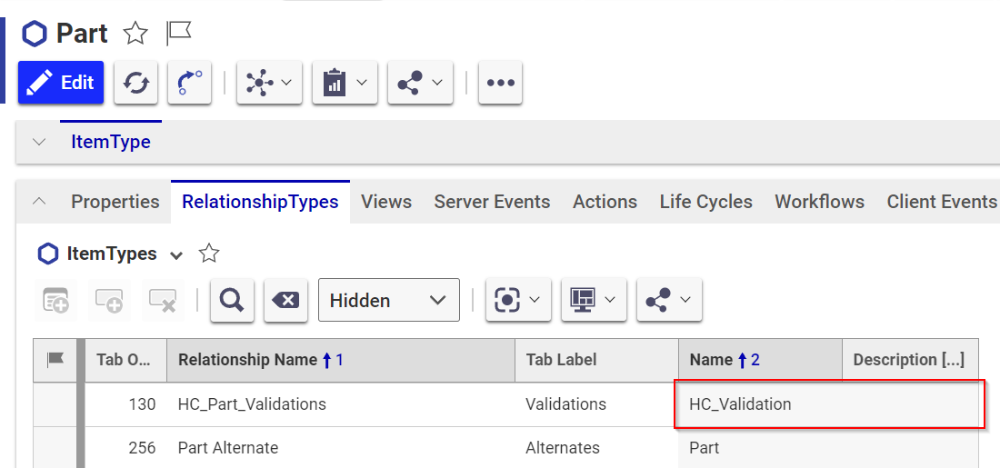
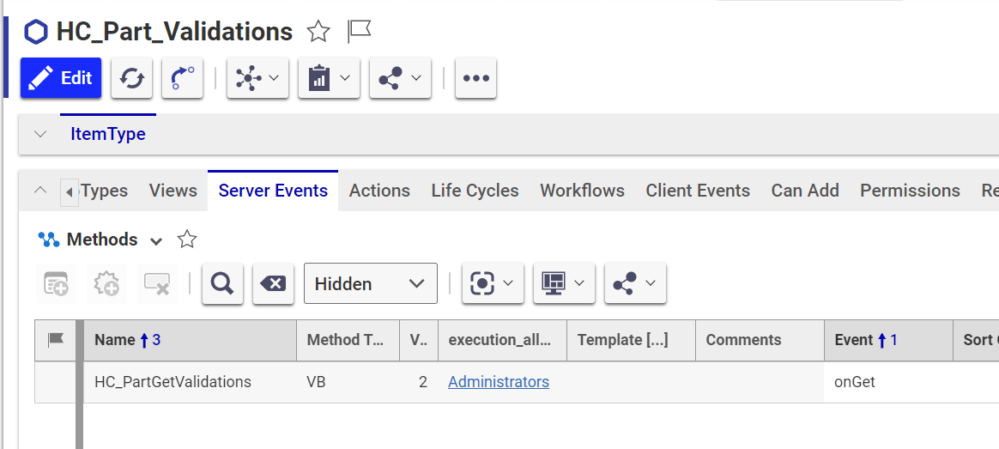
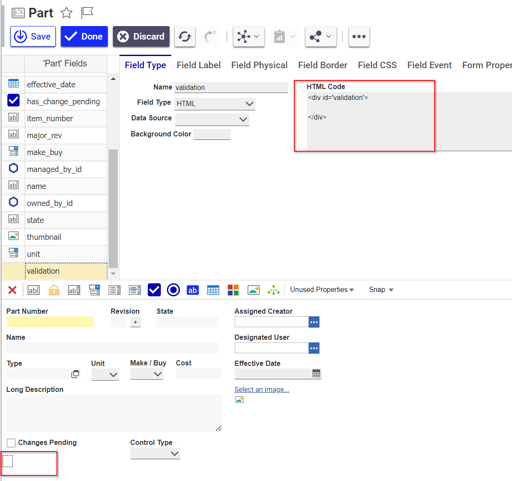
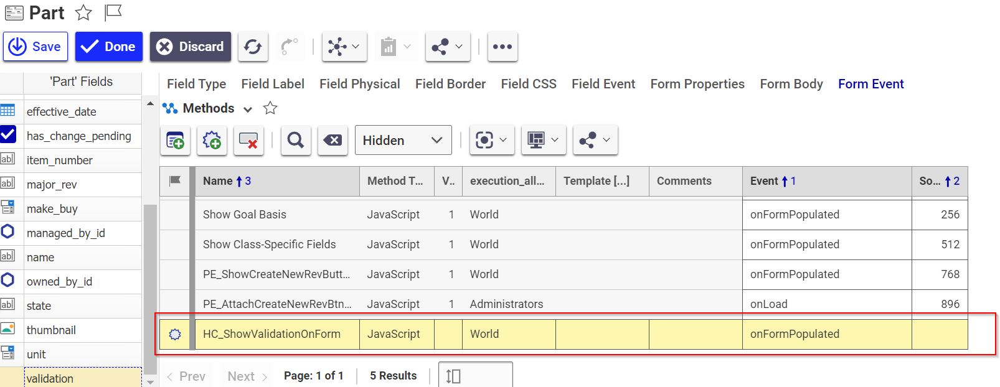

# aras-validations

This is an extended functionality for [Aras Innovator](https://www.aras.com) to validate Items, before the change Life Cycles/Workflow states etc.

This is and has been used in several production environment from Releases R11SP5, R11P12, R12SP8, R14? and R22 and more (Currently being develop using R2023).
In other words it is a quite persistent solution, which has not required any changes. (Besides from one or two performance optimizations)

I have an old (R11) demo of this validation at: Youtube: <https://www.youtube.com/watch?v=WJLfYEj_thI>
It works the same way today even though the Aras GUI has changed.

---

**Table of Contents**

- [Installation](#installation)
  - [Copy images to web application](#copy-images-to-web-application)
  - [Import hc\_core and hc\_core\_examples](#import-hc_core-and-hc_core_examples)
- [How to implement](#how-to-implement)
  - [Add validation relation and method](#add-validation-relation-and-method)
    - [Make validations prevent promotions](#make-validations-prevent-promotions)
  - [Add validation to From](#add-validation-to-from)
    - [Add implementations to HC\_ShowValidationOnForm method](#add-implementations-to-hc_showvalidationonform-method)
- [History](#history)
- [References](#references)


## Installation

### Copy images to web application

Copy the files in webapp/Client/Solutions/hccore/images to `installation-path`/Client/Solutions/hccore/images

### Import hc_core and hc_core_examples

Import the manifest file `src/packages/hc_core.mf` via Aras import tool. This will import the core feature
**Optional:** Import the example for the item type Part by importing the manifest file `src/packages/hc_core_examples.mf`

## How to implement

To implement this we need to do the following.

- Add a validation relationship and add a method with the validation business logic.
  - Hook in a method "looking" at the validations on for instance "onBeforePromote" to be able to prevent promotions when there are validations errors
- (Optional/Recommend): Update form to include a display of warning/error validations.

### Add validation relation and method

Add a new relationship to the Item Type to use validations on, with `HC_Validation` as related item type.



On this relationships item type, add a method on onGet. See [Part Get Validations example](./src/packages/hc_core_examples/Import/Method/HC_PartGetValidations.xml).



At this point you should be able to be able to get the validations presented in the Validations tab.
To have it prevent promotions and get a heads up via the form, please proceed.

#### Make validations prevent promotions

Add a method that should be called onBeforePromote. The [Part_BeforePromote](./src/packages/hc_core_examples/Import/Method/HC_PartBeforePromote.xml) can be used as a template. It is pretty generic, but you may need to adjust some Item Type specific details.

### Add validation to From

- Add a html field with id = "validation"


- Add script to update the validation field


#### Add implementations to HC_ShowValidationOnForm method

``` javascript
const implementations = [
    {   
        itemType: "Part",
        validationRelationshipName: "HC_Part_Validations",
        states: ["Preliminary","In Review"]
    }
    //,
    //{   
    //     itemType: "anotherType",
    //     validationRelationshipName: "anotherRel",
    //     states: ["Working","Review"]
    // }
];
```

## History

This is an extract from [hc_aras_plm_ext](https://github.com/polyfacet/hc_aras_plm_ext), due to the lack of time to keep that project up to date.
The idea was conceived in 2016, when I was part of a PLM project, that migrated a SmarTeam PDM/PLM system to Aras Innovator.
SmarTeam is/(was) a installed client on each users computer and business logic were executed on the client side. There was this feature that was difficult to migrate one-to-one.
The specific thing was that when a user invoked a "Release"-action on a Part, there was this validation being executed. The validation could prompt the user with an `Error`, with a description of the error. This error prevented the release.

**But!** There was also a validation that was only a `Warning`, and the user could choose to either proceed with the release och cancel it. This is not easily solved in Aras Innovator, because when you invoke a "Promote" or "Release" of a Part, this is executed on the server side - i.e. user can not interact with such validation.
So I came up with this idea, which besides from the benefit for being a generic solution - this solution was later implemented on multiple item types, has the great benefit of presenting errors/warnings before the user tries to invoke a "Release"/promotion. Some other benefits compared to other implementations, is that the validations includes links to the item(s) that cause the error/warning.

## References

- Icons found as public domain from <https://www.svgrepo.com/>
